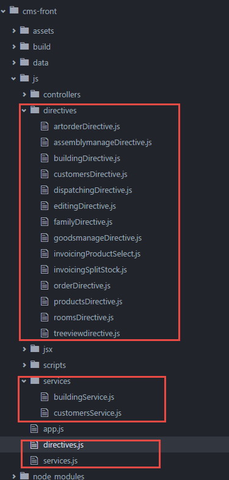

# Angular组件

项目中大量使用了AngularJS的自定义指令及服务，合理使用可较大提高开发效率。

## 文件结构

全局directive全部定义在``js/directives.js``中

业务相关directive定义在``js/directives/*.js``中，会通过相应页面懒加载

全局service和filter全部定义在``js/services.js``中

业务相关service和filter定义在``js/services/*.js``中，也会通过相应页面懒加载

