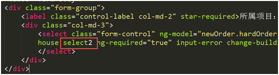
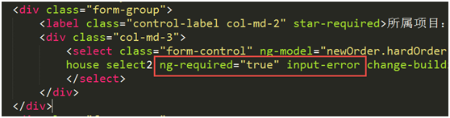

# Custom Directives

DOM 操作尽量通过自定义指令完成，外部插件也可以封装成自定义指令。

## select2

将select2插件封装为自定义指令，在指令中统一处理select2的初始化及事件

* 自动加载select2插件的js/css
* 自动配置默认选项
* ngOptions/ngModel改变会自动刷新数据

## validater

提供了jquery-validation之外的一种表单验证方法

* 使用angular原生$dirty/$ invalid属性和$parsers方法
* 支持实时校验
* angular自动维护表单的校验状态

主要指令包括：inputError/ validateAll

1.使用<ng-form>指令，必须有name attribute
2.设置被观察指令 <... ng-required="true" input-error></...>
3.设置触发按钮 <... validate-all></...>　验证成功后才会调用ngClick

