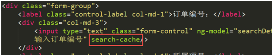

# Custom Directives

DOM 操作尽量通过自定义指令完成，外部插件也可以封装成自定义指令。

## container

递归指令，用于循环生成新商品详情页。

``/tpl/container.html``中枚举所有可能的组件，并每次生成其中一个组件。propertyType为约定好的组件类型名称。

该指令注入RecursionHelper服务，负责生成递归的DOM

## select2

将select2插件封装为自定义指令，在指令中统一处理select2的初始化及事件

* 自动加载select2插件的js/css
* 自动配置默认选项
* ngOptions/ngModel改变会自动刷新数据

## validate

提供了jquery-validation之外的一种表单验证方法

* 使用angular原生$dirty/$ invalid属性和$parsers方法
* 支持实时校验
* angular自动维护表单的校验状态

主要指令包括：inputError/ validateAll

1.使用<ng-form>指令，必须有name attribute
2.设置被观察指令 <... ng-required="true" input-error></...>
3.设置触发按钮 <... validate-all></...>　验证成功后才会调用ngClick

## searchCache

根据产品提出的搜索表格后进详情，再返回列表页，要能对之前的搜索结果进行记忆的需求，生成两个指令：searchCache和searchCacheButton

searchCacheButton一般放置在搜索按钮上，用于保存被标记的输入框的状态

searchCache用于标记该输入框需要被记忆，以及页面跳转时从缓存中提取数据

* 使用$cacheFactory储存
* 调用/resource/init/接口判断页面关联，因为如果不是从详情返回，则无需记忆
* 通过UI-ROUTE的$stateChangeSuccess事件获得路由状态

## buttonSteer

在按键上添加自定义指令buttonSteer，在页面初始化之前调用相应接口获得权限，展示或移除相应按钮。

## timeInput

将timepicker插件封装为自定义指令，通过指令属性配置时间输入框

* 自动加载timepicker js/css文件
* 支持自定义时间格式、最小最大时间、当前时间等多种设置
* 显示中文

## provinces,cities

* 自动通过接口从后台获取省市区，省市区自动关联
* 在省份下拉框添加provinces指令，在城市下拉框添加cities指令
* 可根据楼盘自动填充地址，在楼盘下拉框添加change-building指令

## modalMm,modalSs

* 封装了modalMm，modalSs等几种大小的弹出框，使用方法和原来的modal一致。
* 弹出框消失时，自动清空数据

## productSelectModal

封装了整个商品选择弹出框

## inputNumber

加减数量输入框，可设置数量上下限
