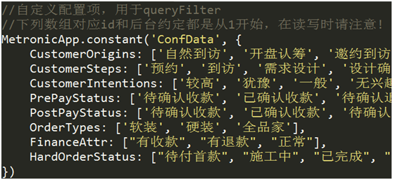
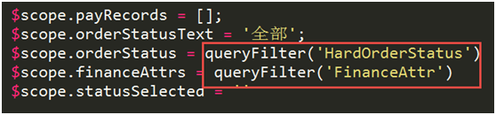

# Custom Filter

filter主要用于将后台返回的数字转化为对应文字。之后又扩展到返回所有文字，用于下拉框显示。

## query

开始filter是分开的，一个业务写一个，由于后来越写越多，最后重构成目前这个。

queryFilter不仅可以获取自定义数据（ConfData），还可以获得缓存的接口数据（使用ajaxCacher返回的同步回调方法）

* 统一定义自定义数据
* 使用ajaxCache缓存的接口数据

