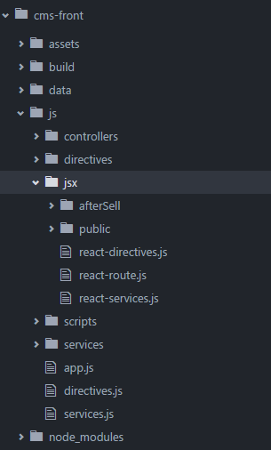

# use React in Angularjs

本次考虑两种场景

1.在原angular页面中插入少量react 组件，这种主要是老页面改造；

2.整个页面采用React，这种是全新功能的开发；

对应的解决方法：

1.可采用将React组件封装到AngularJS自定义指令中，通过指令调用React组件

在``/js/jsx/``文件夹下已经实现了一个业务模块和一些通用组件，通过本方法理论上可以在AngularJS中使用Ant.Design组件，有兴趣的同学可以试一下。

2.可以使用第三方ngReact指令

https://github.com/ngReact/ngReact
