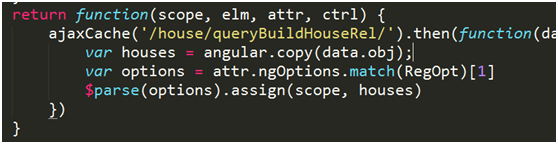
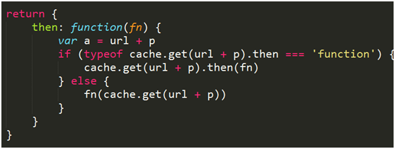

# ajaxCache

实践中发现很多接口的返回数据是基本不变的，但切换路由就会重新请求一次。ajaxCache服务会对接口数据缓存，只有第一次是真实请求，之后都会取缓存数据。

* 使用angular系统服务$cacheFactory缓存接口数据
* 减少接口请求次数
* 根据接口返回情况，采用同步或异步两种回调模式

返回值中重载了then函数，当接口未返回时，返回一个promise对象（异步调用）；当接口已返回，直接调用回调函数（同步调用）

