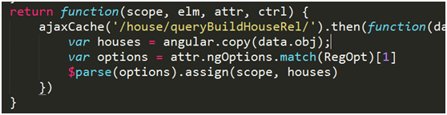

# Custom Services

通用的业务操作可以定义成service，一些外部插件也可以定义成service。

## ajax1

提供不同于jquery的另一种ajax请求服务，对调用方法进行简化

* 使用angular原生的$http方法
* 回调中中不需要使用$scope.$apply()
* 注入blockUI服务，防止接口请求慢时，用户重复点击产生多次请求

## ajaxCache

实践中发现很多接口的返回数据是基本不变的，但切换路由就会重新请求一次。ajaxCache服务会对接口数据缓存，只有第一次是真实请求，之后都会取缓存数据。

* 使用angular系统服务$cacheFactory缓存接口数据
* 减少接口请求次数
* 根据接口返回情况，采用同步或异步两种回调模式

返回值中重载了then函数，当接口未返回时，返回一个promise对象（异步调用）；当接口已返回，直接调用回调函数（同步调用）

## blockUI

对Metronic.blockUI进行封装，支持重复block，原Metronic.blockUI只支持单次block

## dataTable

将datatable插件封装为自定义服务，统一处理表格的配置

* 自动加载datatable插件的js/css
* 每次生成一个新的datatable实例
* 支持自定义配置

## qiniu

封装了qiniu的图片上传接口，返回promise对象。

