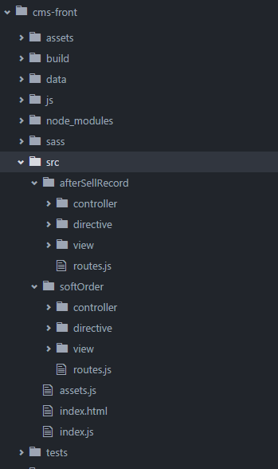

# 原因

1.实现业务优先、模块化的架构。由于现在没有按模块分，合代码时很痛苦，经常会有代码忘记合。平时开发时，找文件也比较费事，要在app.js里搜索

2.app.js已经非常大了，directives.js也越来越大，views和controllers文件夹里有几百个文件

3.可以实现非覆盖式发布

4.可以自动打包文件，减少网络请求

5.提高开发效率，HMR，支持ES2015，自动编译、自动刷新

6.Cross-Domain LocalStorage

# 实现方法

1.根据业务模块化，一个业务一个目录，该业务的view/controller/directive/server/router都放置在业务目录下

2.使用webpack的require.ensure方法设置打包断点，然后根据开发及生产的不同配置，对业务模块分别打包

# 已实现但未上线

在``/src``目录下，已经做好了两个业务模块softOrder和afterSellRecord，如果通过``npm start``起的项目，这两个业务模块会运行，替代掉原来的软装和售后的相关页面。所以，通过``npm start``起的项目，需要注释掉app.js里的orders和reject-orders路由，而通过Tomcat/Apache等server直接起的项目，则无需注释这两块。

