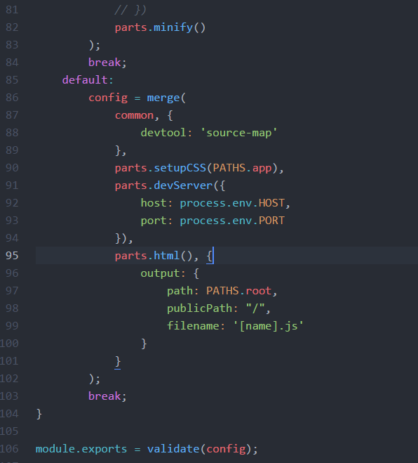

# webpack

webpack是模块加载器兼打包工具，能把各种资源，如JS（含JSX）、coffee、样式（含less/sass）、图片等都作为模块来使用和处理。我们可以直接引用这些资源，即使它们需要经过编译（比如ES6、JSX和Scss），因为webpack有各种加载器（loader）来处理这些事情。

## 配置文件

### webpack.config.js

webpack主配置

### parts.js

webpack功能封装

下面是``npm start``的webpack配置

## 教程

http://survivejs.com/webpack/introduction/
