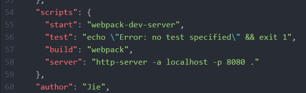

# 环境搭建

SVN下载源码后，可以直接用Tomcat/Apache启动项目根目录，和目前线上环境一样。还可以使用npm命令启动项目，具体原因详见[前端工程化](./engineer/engineer.md)

## npm启动步骤

进入项目根目录下执行
```
npm i
```
若时间过长，或报错，则可以
```
npm i cnpm -g
cnpm i
```
package安装完成后
```
npm start
```

## 自定义命令

命令定义在package.json中



```
npm start //启动webpack-dev-server
npm run build //build项目
npm run server //启动build server，内容和发布到线上是一样的
```
