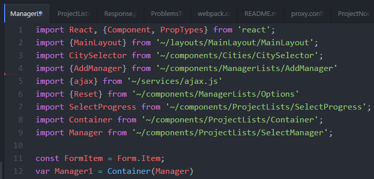

# ES6

项目中用到的主要是class,module,箭头函数等新功能。

## 教程

http://es6.ruanyifeng.com/

## babel-root-import

CommonJS和ES6的模块引用只能采用相对路径或绝对路径，而不能采用相对项目根目录的路径引用，故在本项目中引入了babel-root-import插件

```
// Usually
import SomeExample from '../../../some/example.js';
const OtherExample = require('../../../other/example.js');

// With Babel-Root-Importer
import SomeExample from '~/some/example.js';
const OtherExample = require('~/other/example.js');
```



https://www.npmjs.com/package/babel-root-import
